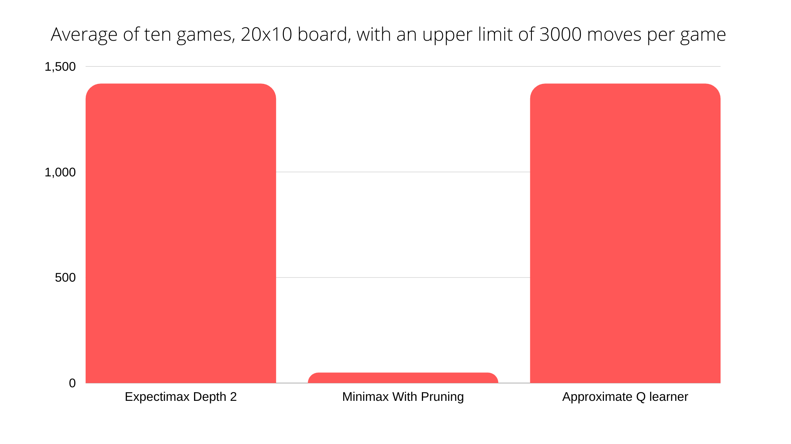
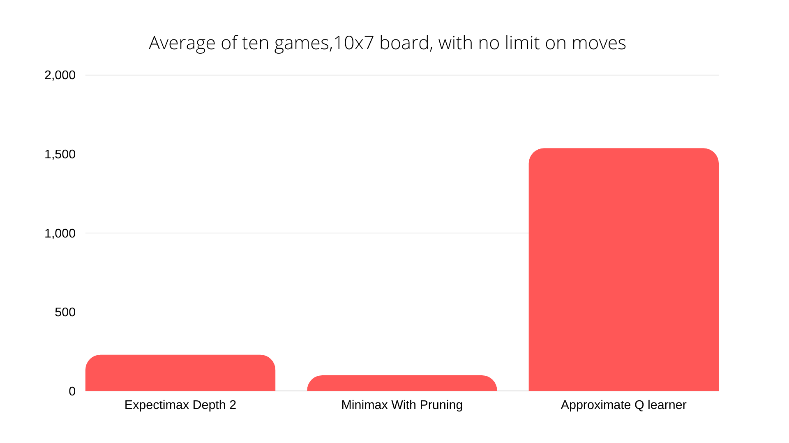

# AITetris Project
The goal of this project was to compare different game-playing agents ability to play Tetris. 
Tetris has been proven to be a NP-complete game, so right off the bat, the goal was to achieve the highest score and not to actually solve the game. 
We designed, implemented and tested an ExpectiMinimax agent, a MiniMax agent with pruning, and an Approximate QLearner agent.\
Details of the implementation can be found here [research paper](https://drive.google.com/file/d/198ObhE1Kks98cmFkzWSYzh3xTsgnFrlx/view?usp=sharing)
## Results
We tested the agents with an upper bound of 3000 moves, over the course of 10 games.\
We found that both ExpectiMax and the Approximate Q learner scored very well while MiniMax strugeled to score at all.



As seen above the ExpectiMinimax and the Approximate Q learner agents yield similar results.\
To get a better idea of which agent is better we made the game significantly harder by reducing the size of the board.\
We can clearly see in the results below that the Approximate Q learner is by far the most successful agent.
  

## Usage
#### Software Requirements
1. python3
2. pygame 2.0
3. numpy 1.19.1

### Choosing an Agent
Play a game of Tetris your self by running the game with out any flags:

```python3  tetris.py``` 

Pick agent: -a, the options are expectimax, alpha_beta, q_learning.\
For example this will simulate an Aproximate Q learner playing Tetris:

```python3  tetris.py -a q_learning``` 
### Approximate Q learner
When playing Tetris with an Aproximate Q learner you are able to customize parameters. \
You can find an explanation of the  parameters [here](https://drive.google.com/file/d/198ObhE1Kks98cmFkzWSYzh3xTsgnFrlx/view?usp=sharing).  

Parameters:

Learning Rate: --alpha, a float between 0 and 1 (default is 0.2)

Discount Factor: --gamma, a float between 0 and 1  (default is 0.75)

Exploration Rate: --epsilon, a float between 0 and 1  (default is 0.05) 

Amount of training rounds: --num_training, an integer,  (default is 10)

Amount of testing rounds: --num_testing, an integer (default is 5)

Gui: --gui, True or False, True will run with a gui, False will print the results to the console (default is True)

### Expectimax, Alpha Beta
Choose depth of the search tree: -d, an integer (default is 1)\
Note that any depth over 2 will result in a very long runtime.\
Example: ```python3  tetris.py -a alpha_beta -d 2``` 

### Board Size
Board size: -s, rows by columns, (default 20X10)\
Example:  ```python3  tetris.py -a alpha_beta -s 10 7``` 
